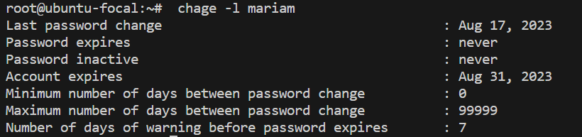
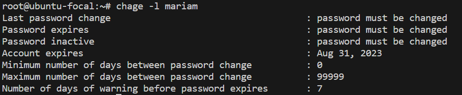
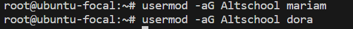
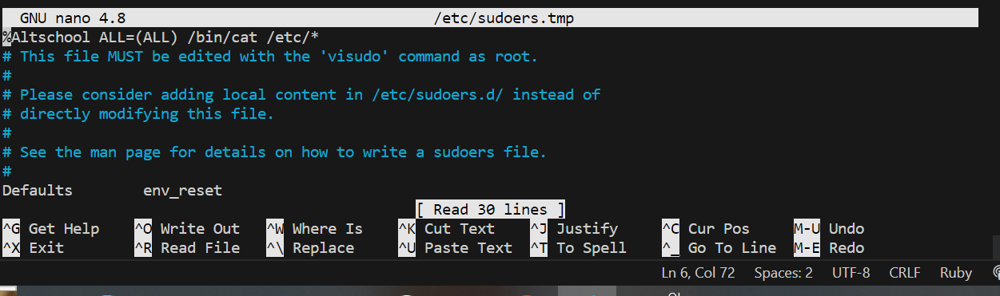

# Mariam Adamu-Ibrahim

## 1. create a user

## 2. Set an expiry date of 2weeks for the user

### 2b. Verify expiry date of 2weeks for the user

## 3. Prompt the user to change their password on login

### 3b. Verify  change of password on login

## 4. attach the user to a group called altschool
### 4a. Creat a group (altschool)

### 4b. Add users to the group (altschool)

## 5. Allow altschool group to be able to run only cat command on /etc/
### 5a. Step1

### 5b. Step2

## 6. Create another user. make sure that this user doesn't have a home directory.

